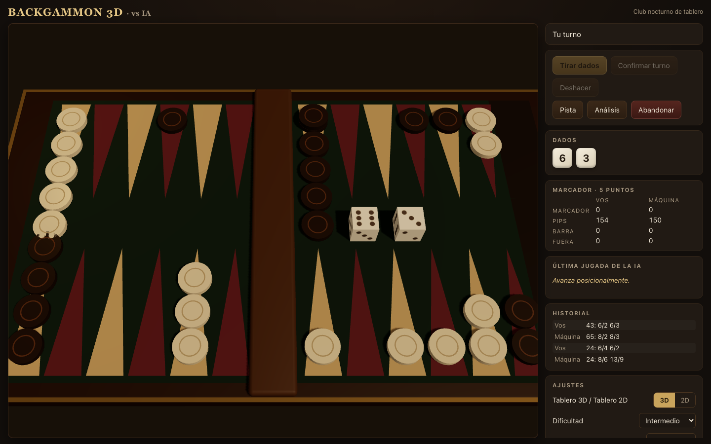
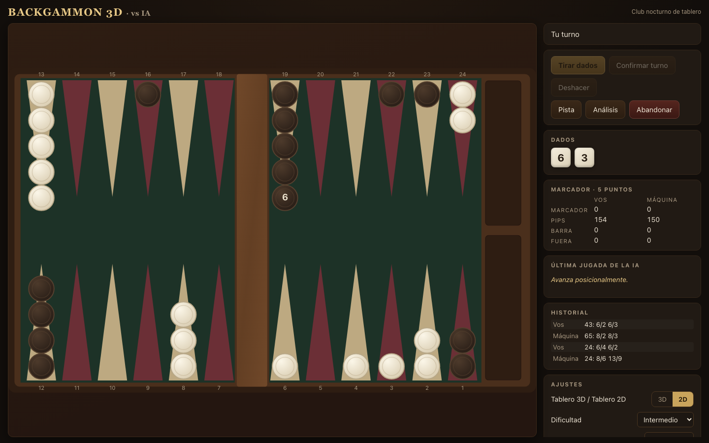

# Backgammon 3D — vs IA

Juego de backgammon completo para jugar contra la máquina, con tablero 3D premium, modo 2D accesible, reglas estándar completas y una IA de tres niveles que corre en un Web Worker. En español por defecto (estructura i18n lista, inglés incluido).




## Stack

- **Vite + React 19 + TypeScript estricto** (por qué no Next.js: [docs/architecture.md](docs/architecture.md))
- **React Three Fiber + drei** — tablero 3D (chunk lazy, three.js solo se descarga en modo 3D)
- **Zustand** — estado del juego y ajustes, persistidos en localStorage
- **Web Worker** — la IA piensa fuera del main thread, con timeout, caché por posición y fallback
- **Vitest + fast-check** (68 tests unit/property/self-play) · **Playwright** (7 E2E) · **oxlint + Prettier**

## Features

- Reglas completas: tirada inicial, barra y entrada obligatoria, golpes, dobles, **uso máximo obligatorio de dados**, **regla del dado mayor**, bear-off (exacto/overshoot/suspensión por golpe), gammon/backgammon, partidas a 1–11 puntos, regla de Crawford y cubo de doblaje opcional.
- IA con 3 niveles: principiante (heurística + ruido), intermedio (1-ply expectiminimax), experto (1-ply profundo, o motor externo GNUbg/wildbg vía HTTP si se configura).
- Elegís tu color: blancas, negras o aleatorio — el tablero rota 180° para que tu home quede siempre abajo a la derecha.
- La IA **nunca** hace movimientos ilegales: cada secuencia se re-valida contra el core de reglas antes de tocar el tablero.
- Tablero 3D (madera/fieltro, dados con animación, cámara orbitable) y 2D SVG (click + drag, resaltado de destinos, animación de vuelo, ARIA + teclado).
- Pista ("Hint"), análisis heurístico de posición, explicación en español de cada jugada de la IA, historial en notación estándar.
- Sonidos sintetizados con WebAudio (sin assets), velocidad de animación configurable, `prefers-reduced-motion`.
- Persistencia local: la partida sobrevive recargas (incluso a mitad del turno de la IA). Modo semilla (`?seed=123`) para partidas reproducibles y export de la partida como JSON (replay: semilla + tiradas + movimientos).
- Responsive: desktop con panel lateral, mobile con 2D por defecto y botones grandes.

## Motor de IA

El motor por defecto es propio (MIT): evaluación heurística en pip-equivalentes (carrera, blots con tabla de probabilidades de hit, puntos, anchors, primes, barra, stacking) + búsqueda 1-ply sobre las 21 tiradas. La investigación completa de motores (GNUbg, gnubg-web, @nodots, wildbg, XG/BGBlitz), las razones de licencia (GPL vs MIT) y **cómo enchufar un motor experto externo** están en [docs/engine-research.md](docs/engine-research.md).

## Correr local

```bash
pnpm install
pnpm dev            # http://localhost:5173
```

## Testear

```bash
pnpm lint           # oxlint
pnpm typecheck      # tsc -b
pnpm test           # Vitest: unit + property + self-play
pnpm test:e2e       # Playwright (instala chromium: pnpm exec playwright install chromium)
```

## Desplegar

```bash
pnpm build          # genera dist/
vercel --prod       # deploy estático en Vercel
```

Opcional: `VITE_EXPERT_ENGINE_URL` en build-time (o Ajustes → "Motor experto (URL)" en runtime) para usar un motor externo con el contrato descrito en [docs/engine-research.md](docs/engine-research.md).

## Acceso con usuario y clave

El sitio desplegado se protege con el mismo esquema que el proyecto de ajedrez: variables de entorno **`BASIC_AUTH_USER`** y **`BASIC_AUTH_PASSWORD`** (más `AUTH_SECRET` opcional para firmar sesiones). Sin esas variables el sitio queda **abierto** (desarrollo local y E2E).

- `middleware.ts` (Vercel Routing Middleware) redirige a `/login` sin sesión válida; también acepta `Authorization: Basic` para scripts.
- `/api/login` valida credenciales (usuario insensible a mayúsculas/espacios, clave estricta) y deja una **cookie de sesión firmada** (HMAC-SHA256, HttpOnly, se borra al cerrar el navegador; firma con TTL de 8 h).
- "Cerrar sesión" en Ajustes borra la cookie vía `/api/logout`.
- Cambiar credenciales: `npx vercel env rm BASIC_AUTH_PASSWORD production preview && npx vercel env add BASIC_AUTH_PASSWORD` (ídem `BASIC_AUTH_USER`), luego redeploy.

## Documentación

- [docs/architecture.md](docs/architecture.md) — capas, decisiones, flujo de turnos
- [docs/rules.md](docs/rules.md) — reglas implementadas y casos límite
- [docs/engine-research.md](docs/engine-research.md) — investigación de motores y licencias

## Limitaciones conocidas

- El nivel "Experto" local es 1-ply heurístico: fuerte para jugadores casuales, lejos de GNUbg 2-ply. El adapter HTTP para motor experto real está implementado pero requiere que el usuario opere su propio servidor (razones de licencia GPL documentadas).
- Abandonar concede automáticamente el nivel derivado de la posición (ver [docs/rules.md](docs/rules.md)); no hay negociación explícita de niveles de resignación.
- El análisis de posición es heurístico, no análisis profesional; la UI lo indica.
- En 3D la interacción es click-click (el drag es del modo 2D); las fichas no vuelan entre puntos en 3D (aparecen con animación de colocación).
- Las decisiones de cubo de la IA usan umbrales cubeless simples (sin ajuste por marcador de match).
- i18n cubre la UI (es/en); las explicaciones de jugadas de la IA están solo en español.

## Licencia

[MIT](LICENSE). No incluye código GPL: los motores GPL (GNU Backgammon y derivados) solo se usan, opcionalmente, como servicios externos operados por el usuario.
